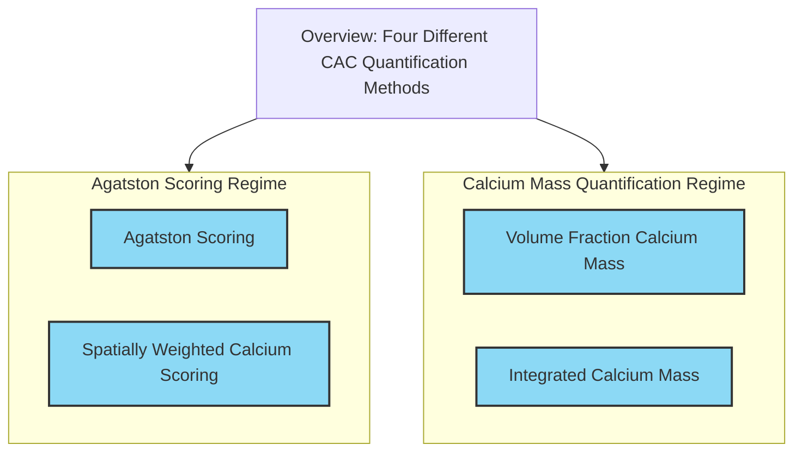

# CalciumScoringSlicer

CalciumScoringSlicer is a 3D Slicer plugin for calculating coronary artery calcium scores from CT images using different quantification algorithms. See the [documentation](https://glassnotebook.io/r/7uus7O8aIcLsGebjQFqxU/docs/(00)%20Getting%20Started.jl) for more details.

## Features

- Handles scan calibration and voxel spacing information
- Easy to use GUI

## Installation

WIP

## Usage

The general workflow is:

1. Load DICOM Data
2. Create segmentation and segment the parts you need
3. Enter algorithm specific module from CalciumScoring category from dropdown menu
4. Select corresponding required and optional inputs (input volume, segmentation, etc.)
5. Press score button

### Algorithms
The main algorithms available are:
- `Agatston()`: Traditional Agatston scoring
- `VolumeFraction()`: Volume fraction calcium mass
- `Integrated()`: Integrated calcium mass
- `SpatiallyWeighted()`: Spatially weighted calcium scoring
